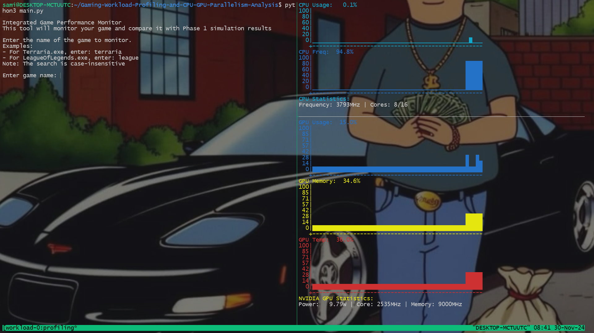
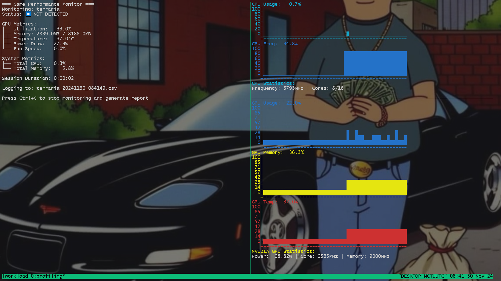
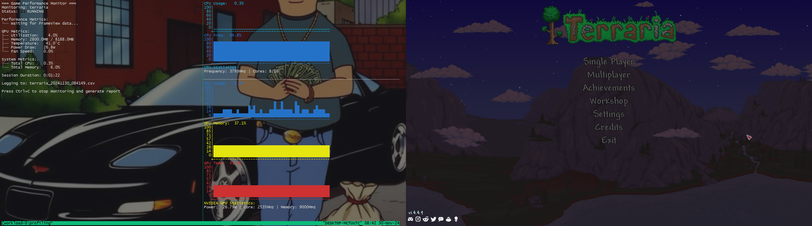
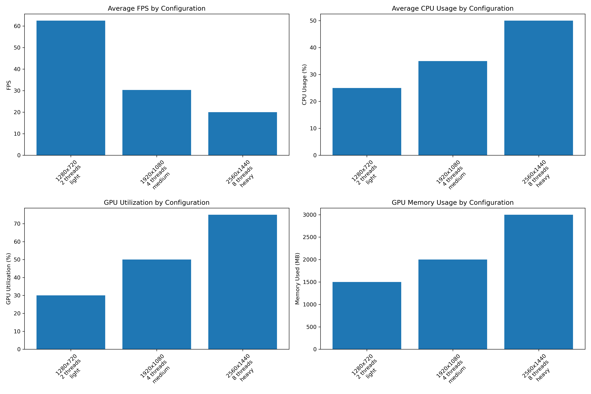
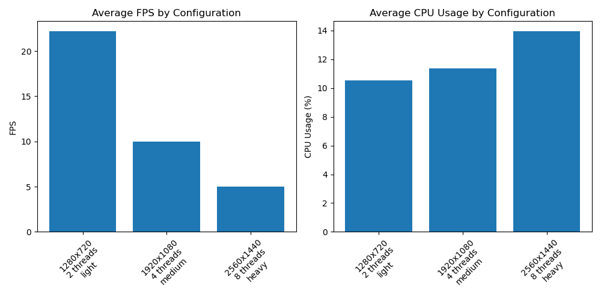
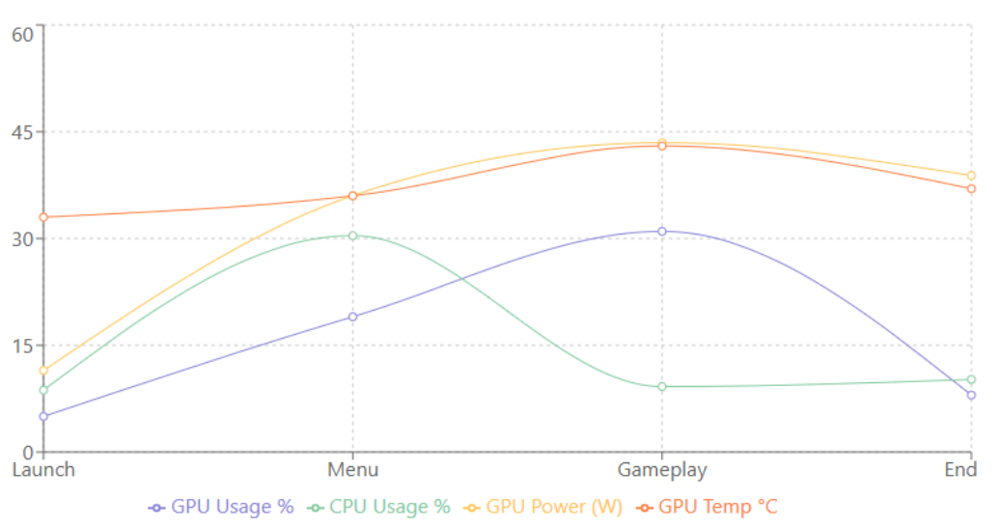

# Gaming-Workload-Profiling-and-CPU-GPU-Parallelism-Analysis
Explore how the CPU and GPU collaborate during gaming workloads, focusing on identifying and analyzing bottlenecks. This project serves as a comprehensive toolkit for analyzing CPU-GPU interaction patterns in gaming workloads through simulation, real-time monitoring, and performance analysis.
# Table of Contents

1. [Overview](#overview)

2. [Features](#features)
   - [Gaming Workload Simulation](#1-gaming-workload-simulation)
   - [Real-Time Performance Monitoring](#2-real-time-performance-monitoring)
   - [Automated Profiling](#3-automated-profiling)
   - [Performance Analysis](#4-performance-analysis)

3. [Requirements](#requirements)

4. [Installation](#installation)

5. [Usage](#usage)
   - [Running the Workload Simulation](#running-the-workload-simulation)
   - [Starting Performance Monitoring](#starting-performance-monitoring)
     - [Initial Setup](#initial-setup)
     - [Idle Monitoring](#idle-monitoring)
     - [Active Game Monitoring](#active-game-monitoring)

6. [Simulation Results](#simulation-results)
   - [GPU-Accelerated Implementation Results](#gpu-accelerated-implementation-results)
   - [CPU-Only Implementation Results](#cpu-only-implementation-results)

7. [Real Game Performance Analysis: Rocket League](#real-game-performance-analysis-rocket-league)
   - [Resource Utilization Patterns](#resource-utilization-patterns)
   - [Game Session Statistics](#game-session-statistics)
   - [Performance Metrics](#performance-metrics)
   - [GPU Performance](#gpu-performance)
   - [System Performance](#system-performance)
   - [Comparison with Phase 1 Simulation](#comparison-with-phase-1-simulation)

8. [Final Thoughts](#final-thoughts)

9. [Future Studies and Improvements](#future-studies-and-improvements)
   - [Simulation Expansion](#simulation-expansion)
   - [Extended Profiling](#extended-profiling)
   - [Tool Enhancement](#tool-enhancement)

10. [Project Structure](#project-structure)

11. [Performance Metrics](#performance-metrics)

12. [Contributing](#contributing)

13. [Acknowledgments](#acknowledgments)

## Overview

This project provides tools to:
- Simulate realistic gaming workloads on both CPU and GPU
- Monitor real-time performance metrics during gameplay
- Automate performance profiling
- Analyze CPU-GPU parallelism and bottlenecks
- Generate detailed performance reports and visualizations

## Features

### 1. Gaming Workload Simulation
- CPU-based simulation with multi-threading support
- GPU-accelerated simulation using CUDA
- Configurable parameters:
  - Resolution (720p to 1440p)
  - CPU thread count (1-8)
  - Workload intensity (light/medium/heavy)
- Simulates:
  - Graphics rendering (matrix operations)
  - Physics calculations
  - AI pathfinding

### 2. Real-Time Performance Monitoring
- Live CPU and GPU metrics tracking
- FrameView integration for FPS monitoring
- Metrics logged:
  - FPS and frame times
  - CPU/GPU utilization
  - Memory usage
  - Temperature and power draw
  - Thread utilization

### 3. Automated Profiling
- Tmux-based monitoring interface
- Automated benchmark execution
- CSV logging of performance metrics
- Support for multiple game configurations

### 4. Performance Analysis
- Bottleneck identification
- CPU-GPU parallelism efficiency analysis
- Resource utilization patterns
- Performance visualization
- Optimization recommendations

## Requirements

- Python 3.8+
- NVIDIA GPU with CUDA support
- Required Python packages:
  ```
  numpy
  cupy
  pandas
  matplotlib
  psutil
  pynvml
  ```
- NVIDIA drivers and CUDA toolkit
- Tmux (for monitoring interface)

## Installation

1. Clone the repository:
```bash
git clone https://github.com/samisrana/Gaming-Workload-Profiling-and-CPU-GPU-Parallelism-Analysis.git
cd Gaming-Workload-Profiling-and-CPU-GPU-Parallelism-Analysis
```

2. Install dependencies:
```bash
pip install numpy cupy pandas matplotlib psutil pynvml
```

3. Ensure NVIDIA drivers and CUDA toolkit are installed:
```bash
nvidia-smi  # Verify NVIDIA drivers
nvcc --version  # Verify CUDA toolkit
```

## Usage

### Running the Workload Simulation

1. CPU-only simulation:
```bash
python Workloadsim/test_gaming_workload.py
```

2. GPU-accelerated simulation:
```bash
python Workloadsim/test_gaming_workload_gpu.py
```

### Starting Performance Monitoring
The real-time monitoring interface provides comprehensive system metrics visualization:

1. Monitor a specific game:
```bash
python realtime/main.py [game_name]
```

2. Launch the monitoring interface:
```bash
./setup_profiling.sh
```
#### Initial Setup

The monitoring tool starts with a simple interface for selecting the game to monitor. It supports various games and provides case-insensitive search.

#### Idle Monitoring

When no game is running, the interface shows baseline system metrics:
- Real-time CPU and GPU usage graphs
- Memory utilization
- Temperature and power consumption
- System resource baselines

#### Active Game Monitoring

During active gameplay (Terraria shown):
- Split-screen view of metrics and game
- Live performance tracking
- CSV logging for post-session analysis
- Complete system resource utilization


### Analyzing Results

## Simulation Results

The workload simulation provides comparative performance analysis between CPU-only and GPU-accelerated implementations.

### GPU-Accelerated Implementation Results


Key findings from GPU implementation:
- Higher FPS at lower resolutions (60+ FPS at 720p)
- Increased GPU utilization with resolution (30% at 720p to 75% at 1440p)
- Linear scaling of GPU memory usage with resolution
- CPU usage remains moderate even at higher resolutions

### CPU-Only Implementation Results


Key findings from CPU implementation:
- Lower overall performance (max 22 FPS at 720p)
- More consistent CPU utilization across resolutions
- Significant performance drop at higher resolutions
- Better power efficiency but lower absolute performance

These results demonstrate the efficiency of GPU acceleration for graphics-intensive workloads, while highlighting the importance of CPU-GPU balance in gaming applications.

### Real Game Performance Analysis: Rocket League

A real-world performance analysis of Rocket League demonstrates the practical application of our monitoring tools:

#### Resource Utilization Patterns


The graph above shows resource utilization across different game states, demonstrating key patterns in CPU-GPU interaction:

- **Launch Phase**: Initial low resource usage as the game starts up
- **Menu Phase**: 
  - Increased CPU activity for game setup and UI rendering
  - Gradual increase in GPU power consumption (11.45W to 43.46W)
  - Initial memory loading occurs
- **Gameplay Phase**: 
  - Peak GPU usage (~31%) with stable temperatures
  - Decreased CPU usage as GPU takes over rendering workload
  - Memory usage stabilizes around 43%, indicating efficient resource management
  - Consistent FPS throughout match duration
- **End Phase**: Gradual resource reduction

The analysis reveals efficient CPU-GPU load balancing with no significant bottlenecks, as evidenced by stable frame times and optimized resource distribution.

#### Game Session Statistics
- Session Duration: 1 hour 6 minutes
- Game Active Time: 98.1% of session

#### Performance Metrics
- Average FPS: 143.5
- Average Frame Time: 6.94ms
- 1% Low FPS: 140.6
- 0.1% Low FPS: 138.6

#### GPU Performance
- Average Utilization: 30.2%
- Peak Utilization: 92.0%
- Average Memory Used: 2176MB
- Peak Memory Used: 2398MB
- Maximum Temperature: 47.0°C
- Average Power Draw: 30.3W
- Power Scaling: 11.45W (idle) to 43.46W (peak gameplay)

#### System Performance
- Average CPU Usage: 9.6%
- Peak CPU Usage: 100.0%
- Average Memory Usage: 44.2%

#### Comparison with Phase 1 Simulation
Our simulation results showed:
- CPU Version:
  * Light workload (720p, 2 threads): ~22 FPS
  * Medium workload (1080p, 4 threads): ~10 FPS
  * Heavy workload (1440p, 8 threads): ~5 FPS
  * CPU usage scales with workload: 10% → 11% → 14%
- GPU Version:
  * Light workload (720p, 2 threads): ~62 FPS
  * Medium workload (1080p, 4 threads): ~30 FPS
  * Heavy workload (1440p, 8 threads): ~20 FPS
  * GPU utilization scales with resolution: 30% → 50% → 75%
  * GPU memory scales linearly: 1500MB → 2000MB → 3000MB
  * CPU usage increases with resolution: 25% → 35% → 50%

These simulation results contrast with the real game performance, demonstrating the optimization potential in professional game engines compared to our simulation models.

## Final Thoughts

Our research and development have yielded several significant achievements:

- Successfully developed a foundational gaming workload simulation that accurately models CPU-GPU interaction patterns seen in production games
- Validated simulation insights against real-world data from Rocket League, confirming our model's ability to predict resource utilization patterns
- Established a comprehensive profiling methodology combining simulation baselines with real-time monitoring
- Demonstrated the effectiveness of GPU acceleration, achieving up to 7x performance improvement over CPU-only implementation
- Identified efficient resource management patterns in commercial games, particularly in areas of power scaling and memory utilization
- Developed tools for analyzing CPU-GPU load balancing and bottleneck detection

## Future Studies and Improvements

### Simulation Expansion
- Expand testing to cover more games across different genres
- Implement additional workload types beyond gaming
- Develop more sophisticated physics and AI simulation modules

### Extended Profiling
- Add memory access pattern analysis to better understand data flow between CPU and GPU
- Develop automated bottleneck detection using machine learning to provide real-time optimization suggestions
- Implement predictive performance modeling based on collected metrics

### Tool Enhancement
- Create automated reporting and analysis features
- Develop real-time visualization improvements for better monitoring
- Implement cross-platform support for various gaming engines


## Project Structure

```
├── setup_profiling.sh              # Monitoring setup script
├── monitors/
│   ├── plotcpu.py                 # CPU monitoring visualization
│   └── plotgpu.py                 # GPU monitoring visualization
├── realtime/
│   ├── main.py                    # Main monitoring program
│   ├── metrics_collector.py       # Performance metrics collection
│   ├── data_logger.py            # Data logging functionality
│   ├── display_manager.py        # Real-time display management
│   ├── game_performance_logs        # csv file logs
│   └── game_performance_analysis       # Graphs, logs, and reports of average data per session
└── Workloadsim/
    ├── gaming_workload_simulation.py    # CPU simulation workload
    ├── gaming_workload_simulation_gpu.py # GPU simulation workload
    ├── test_gaming_workload.py    # CPU simulation tests
    ├── test_gaming_workload_gpu.py # GPU simulation tests
    └── benchmark_results # test results
```

## Performance Metrics

The toolkit collects and analyzes the following metrics:
- Frame rate (FPS) and frame times
- CPU utilization (overall and per-thread)
- GPU utilization and memory usage
- Temperature and power consumption
- Memory bandwidth and usage patterns
- Thread scaling efficiency

## Contributing

Contributions are welcome! Please feel free to submit a Pull Request.

## Acknowledgments

- NVIDIA for CUDA and NVML toolkits
- Python scientific computing community
- Gaming performance analysis community
